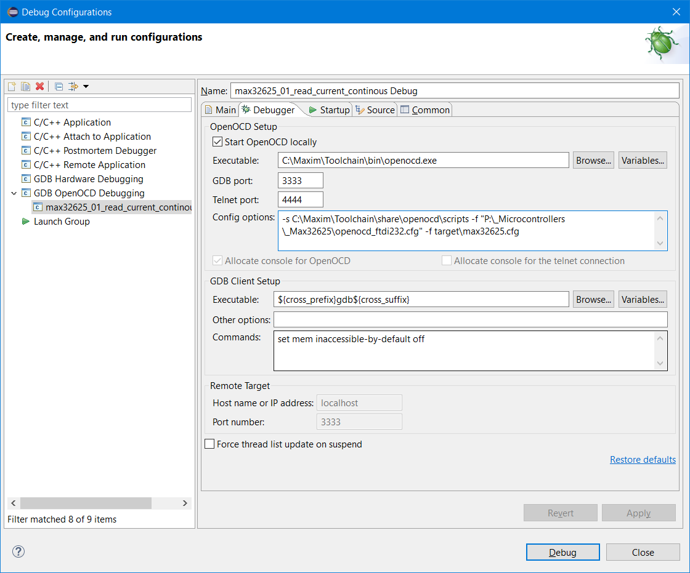
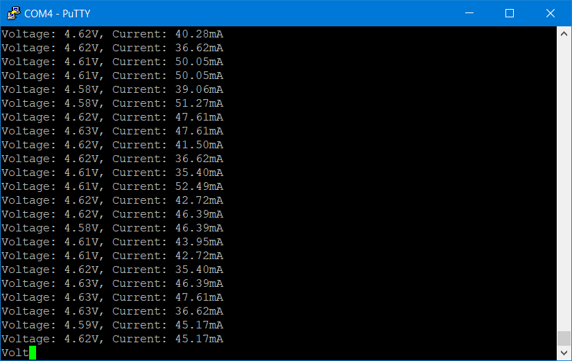

# Exmaple 03: Simple combined voltage and current measurement
This example shows basic usage of MAX40080 CSA sensor. It is very similart to [example 1](../01_read_current_continous) and [example 2](../02_read_voltage_continous), but collect samples of both current at voltage using single call.

Code does following tasks:

1. Init the library
2. Configure sensor
3. Read current samles in infinite loop
4. Print samples over UART

## Platform neutral example code

```cpp
#include "MAX40080.h"

int main(void) {
	MAX40080_Status status;

	status = MAX40080_Init();
	// handle error if status is non-zero

	MAX40080_Configuration config;
	MAX40080_GetDefaultConfiguration(&config);
	config.adcSampleRate = MAX40080_AdcSampleRate_Both_at_0_5_ksps;
	config.inputRange = MAX40080_InputRange_50mV;
	config.operatingMode = MAX40080_OperationMode_Active;

	status = MAX40080_SetConfiguration(&config);
	// handle error if status is non-zero

	MAX40080_FifoConfiguration fifoConfig;
	MAX40080_GetFifoDefaultConfiguration(&fifoConfig);
	fifoConfig.storingMode = MAX40080_FifoStoringMode_CurrentAndVoltage;

	status = MAX40080_SetFifoConfiguration(&fifoConfig);
	// handle error if status is non-zero

	while (1) {
		float current;
		float voltage;

		status = MAX40080_ReadCurrentAndVoltage(&current, &voltage);
		if (status && status != MAX40080_Status_FifoIsEmpty) {
			// handle error
			continue;
		}

		if (status == MAX40080_Status_FifoIsEmpty) {
			continue;
		}
		
		// print voltage and current over UART
	}
}
```

## Initializing library

Initialization is the same as in [example 1](../01_read_current_continous) and [example 2](../02_read_voltage_continous).


## Configure sensor

Configuration is almost the same as in [example 1](../01_read_current_continous) and [example 2](../02_read_voltage_continous). But there are two differences:

1. ADC Sample Rate is reduced to 0.5 kHz which is requirement for measuring both current and voltage by sensor.
2. FIFO is configured to store both values

Skipping the first step causes the `MAX40080_SetFifoConfiguration` function to fail with status code `MAX40080_Status_InvalidOperation`.

The main MAX40080 configuration looks as foolows in the example

```cpp
MAX40080_Configuration config;
MAX40080_GetDefaultConfiguration(&config);
config.adcSampleRate = MAX40080_AdcSampleRate_Both_at_0_5_ksps;
config.operatingMode = MAX40080_OperationMode_Active;

status = MAX40080_SetConfiguration(&config);
if (status) {
	// handle errro
}
```

## Reading samples from sensor

Reading samples is the same as in [example 1](../01_read_current_continous) and [example 2](../02_read_voltage_continous). Only change is that function `MAX40080_ReadCurrent` is replaced by `MAX40080_ReadCurrentAndVoltage` which provides both values using single I2C transaction. Handling the empty fifo is the same like in [example 1](../01_read_current_continous) and [example 2](../02_read_voltage_continous).

# Configurable constans
Library and this example assumes using with MikroE Current 6 Click board. If you use other or custom board, for correct operation you need to edit `MAX40080_I2C_7BIT_ADDRESS` and `MAX40080_SHUNT_RESISOTR_VALUE` constants in `MAX40080.h` file. I2C address depends on value of resistor connected to A0 pin. Consult I2C Slave Addresses table in datasheet for getting address number coresponding to your resistor. Both MikroE Current 6 Click Board and MAX40080EVKIT uses 100kOhm resisotr which coresponds to address 0x21. Similarly you need to change values of shunt resistor as a float value in ohms. MikroeE Current 6 Click Board uses 10mOhm (0.010 ohms) and this value is by default in source code. MAX40080EVKIT uses shunt resistor of value 0.050 ohms and if you use this board you need to update `MAX40080_SHUNT_RESISOTR_VALUE` constant to this value.

# MAX32625 port
This example is implemented for MAX32625 MCU targetting MAX32625PICO board and MikroE Current 6 Click Board containing MAX40080 sensor. Folder [max32625](max32625) contains Eclipse project created using `MAX32625PeriphDriver` from [Low Power Microcontroller SDK](https://www.maximintegrated.com/en/design/software-description.html/swpart=SFW0001500A).

> :warning: Implementation use 3.3V voltage level. MikroE Current 6 Click Board has onboard level shifter. If you use different board like MAX40080EVKIT, then you need to modify the `MAX40080_PlatformSpecific.c` file and remove TWO `SYS_IOMAN_UseVDDIOH(&gpio);` lines from `MAX40080_PlatformSpecific_Init`.

For deploying and debugging directly from Eclipse you will need to define Launch configuration. Use the same Launch configuration which you use for launching examples from MAX32625 SDK. For debugging use `GDB OpenOCD Debugging`, C/C++ Application set to `build\max32625.elf`. At `Debugger` tab set Executable to `C:\Maxim\Toolchain\bin\openocd.exe`, GDB port 3333, telnet port 4444 and config options set to:

```
-s C:\Maxim\Toolchain\share\openocd\scripts -f "interface/{name_of_script_file_related_to_your_debug_probe}.cfg" -f target\max32625.cfg
```

For example:



# Example output


